# cmaps

## magma
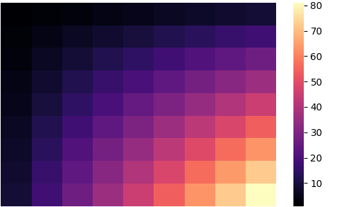
##

## inferno

##

## plasma
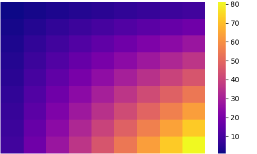
##

## viridis

##

## cividis
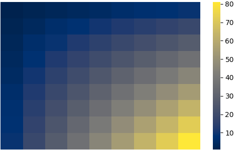
##

## twilight
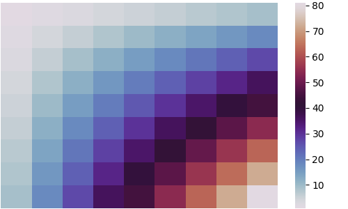
##

## twilight_shifted
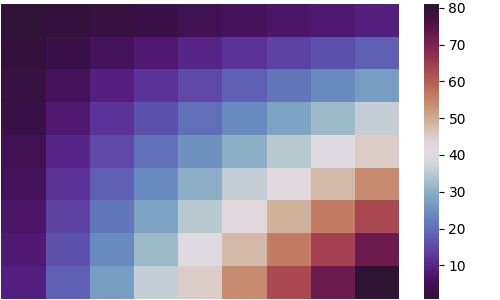
##

## turbo
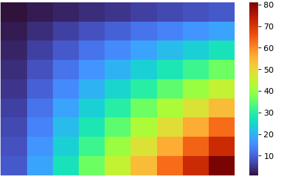
##

## Blues

##

## BrBG
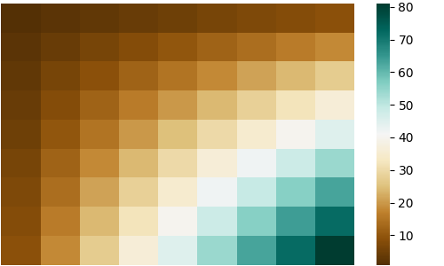
##

## BuGn
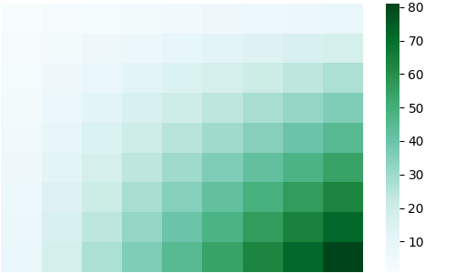
##

## BuPu

##

## CMRmap
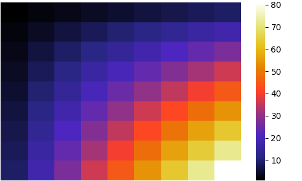
##

## GnBu

##

## Greens
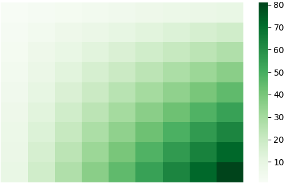
##

## Greys
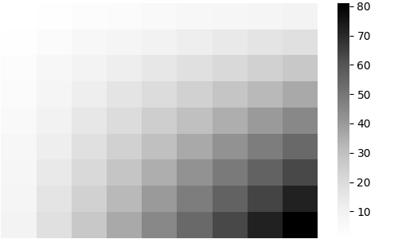
##

## OrRd
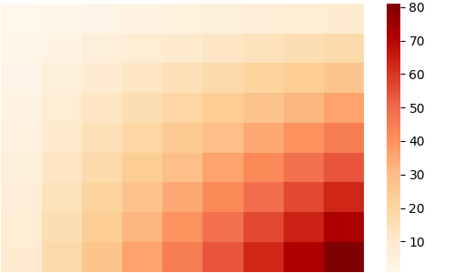
##

## Oranges

##

## PRGn

##

## PiYG

##

## PuBu
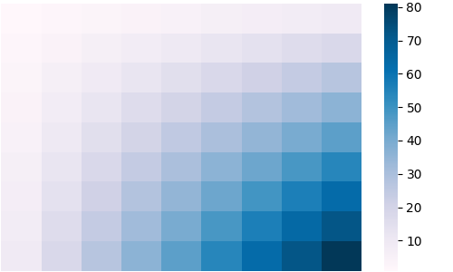
##

## PuBuGn
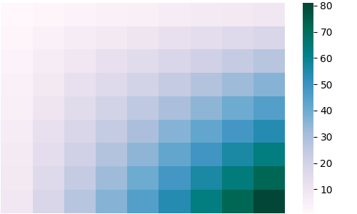
##

## PuOr

##

## PuRd
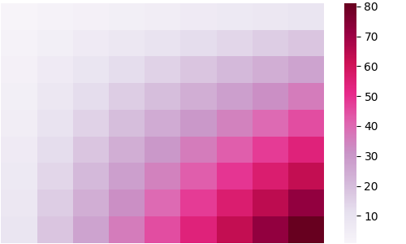
##

## Purples
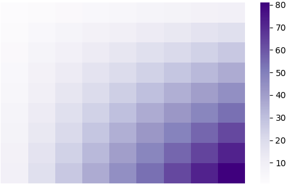
##

## RdBu

##

## RdGy
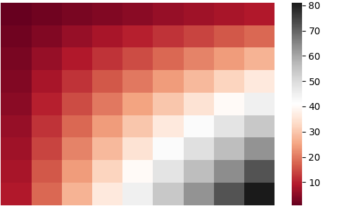
##

## RdPu

##

## RdYlBu

##

## RdYlGn

##

## Reds

##

## Spectral
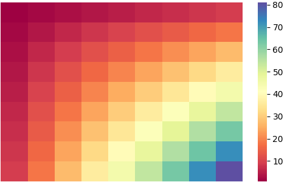
##

## Wistia
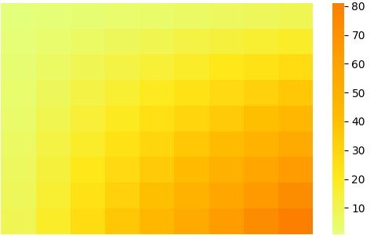
##

## YlGn

##

## YlGnBu
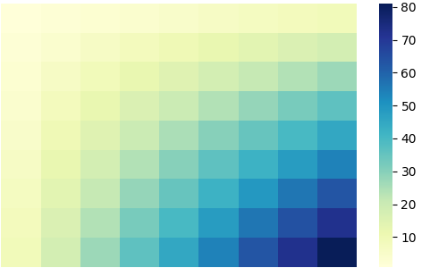
##

## YlOrBr
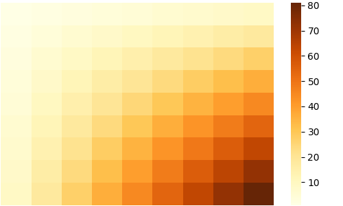
##

## YlOrRd
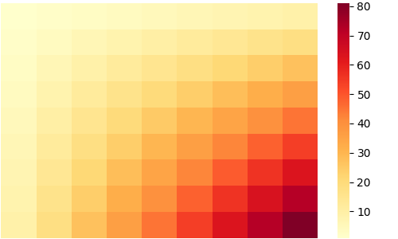
##

## afmhot
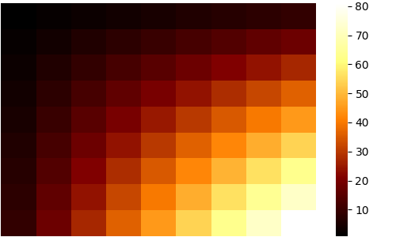
##

## autumn
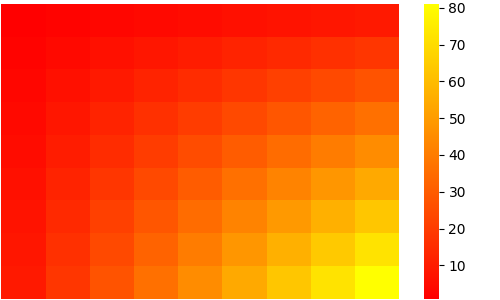
##

## binary

##

## bone
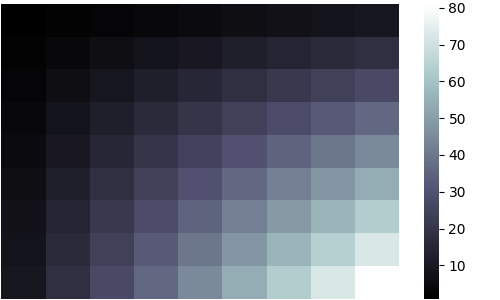
##

## brg

##

## bwr
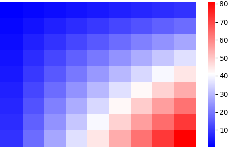
##

## cool
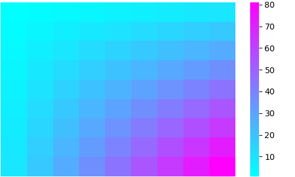
##

## coolwarm

##

## copper
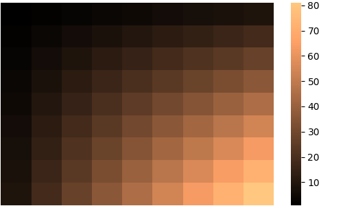
##

## cubehelix
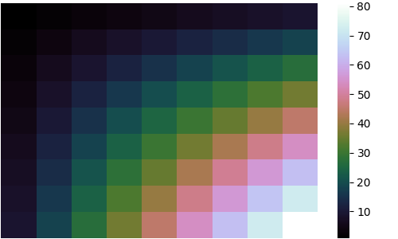
##

## flag
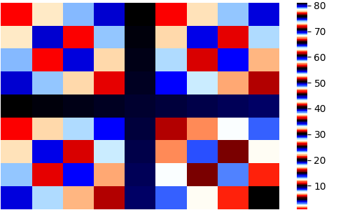
##

## gist_earth
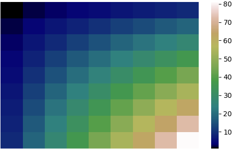
##

## gist_gray

##

## gist_heat
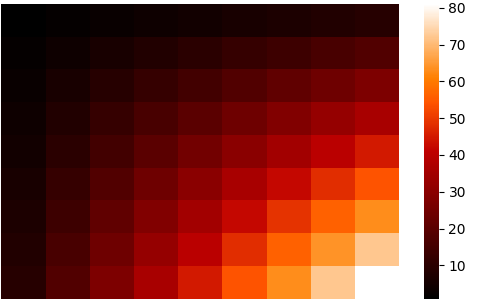
##

## gist_ncar
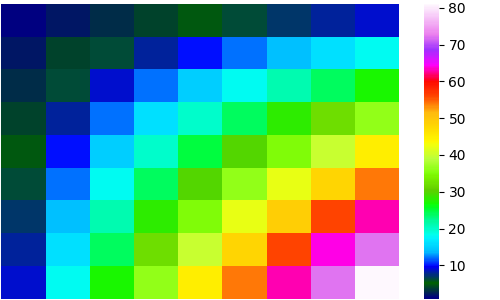
##

## gist_rainbow
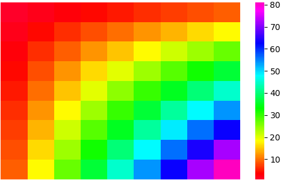
##

## gist_stern
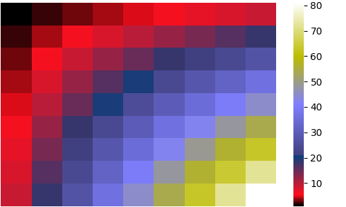
##

## gist_yarg

##

## gnuplot
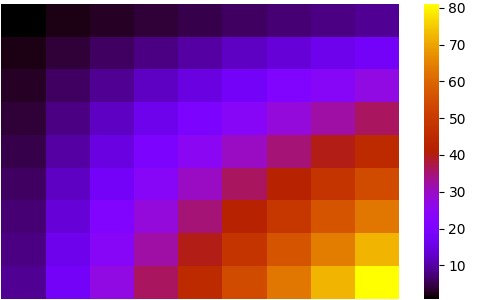
##

## gnuplot2

##

## gray

##

## hot
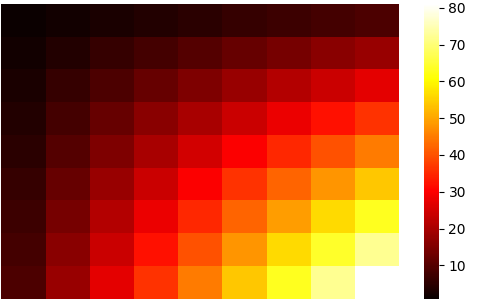
##

## hsv
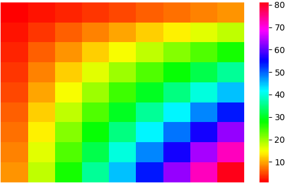
##

## jet
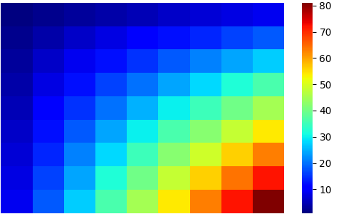
##

## nipy_spectral

##

## ocean
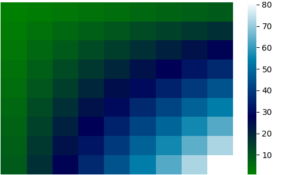
##

## pink
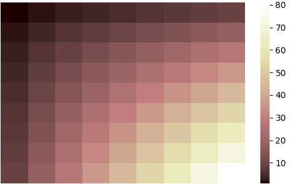
##

## prism
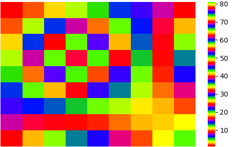
##

## rainbow
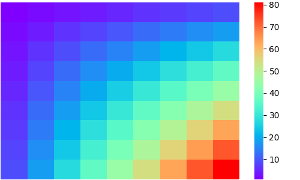
##

## seismic

##

## spring
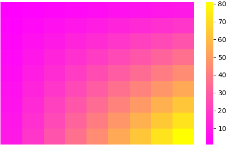
##

## summer

##

## terrain
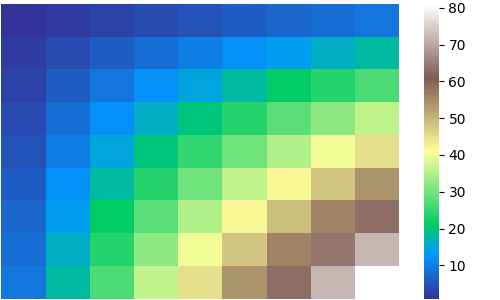
##

## winter
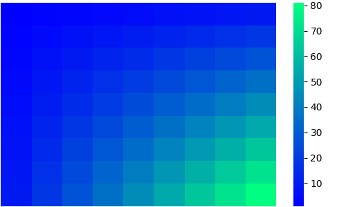
##

## Accent
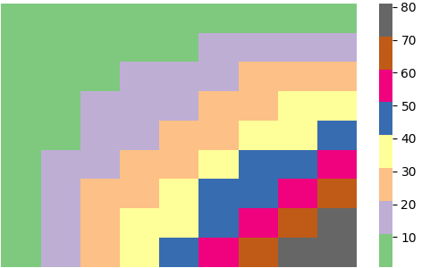
##

## Dark2

##

## Paired
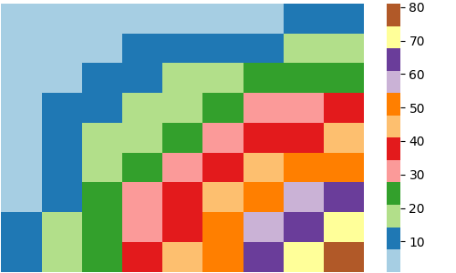
##

## Pastel1
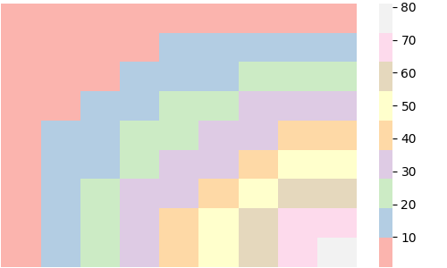
##

## Pastel2

##

## Set1
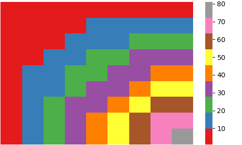
##

## Set2

##

## Set3

##

## tab10

##

## tab20

##

## tab20b

##

## tab20c

##

## grey

##

## gist_grey

##

## gist_yerg

##

## Grays

##

## magma_r

##

## inferno_r

##

## plasma_r

##

## viridis_r

##

## cividis_r

##

## twilight_r

##

## twilight_shifted_r

##

## turbo_r

##

## Blues_r

##

## BrBG_r

##

## BuGn_r

##

## BuPu_r

##

## CMRmap_r

##

## GnBu_r

##

## Greens_r

##

## Greys_r

##

## OrRd_r

##

## Oranges_r

##

## PRGn_r

##

## PiYG_r

##

## PuBu_r

##

## PuBuGn_r

##

## PuOr_r

##

## PuRd_r

##

## Purples_r

##

## RdBu_r

##

## RdGy_r

##

## RdPu_r

##

## RdYlBu_r

##

## RdYlGn_r

##

## Reds_r

##

## Spectral_r

##

## Wistia_r

##

## YlGn_r

##

## YlGnBu_r

##

## YlOrBr_r

##

## YlOrRd_r

##

## afmhot_r

##

## autumn_r

##

## binary_r

##

## bone_r

##

## brg_r

##

## bwr_r

##

## cool_r

##

## coolwarm_r

##

## copper_r

##

## cubehelix_r

##

## flag_r

##

## gist_earth_r

##

## gist_gray_r

##

## gist_heat_r

##

## gist_ncar_r

##

## gist_rainbow_r

##

## gist_stern_r

##

## gist_yarg_r

##

## gnuplot_r

##

## gnuplot2_r

##

## gray_r

##

## hot_r

##

## hsv_r

##

## jet_r

##

## nipy_spectral_r

##

## ocean_r

##

## pink_r

##

## prism_r

##

## rainbow_r

##

## seismic_r

##

## spring_r

##

## summer_r

##

## terrain_r

##

## winter_r

##

## Accent_r

##

## Dark2_r

##

## Paired_r

##

## Pastel1_r

##

## Pastel2_r

##

## Set1_r

##

## Set2_r

##

## Set3_r

##

## tab10_r

##

## tab20_r

##

## tab20b_r

##

## tab20c_r

##

## rocket

##

## rocket_r

##

## mako

##

## mako_r

##

## icefire

##

## icefire_r

##

## vlag

##

## vlag_r

##

## flare

##

## flare_r

##

## crest

##

## crest_r

##

# qiita_cmap
